# VG Fork of ODK Central

This is a VG fork of the upstream ODK Central meta repo (`client/` + `server/` submodules):

- Upstream: `getodk/central`
- This fork focuses on operational security for App Users (Field Keys), and enabling an ODK Collect workflow with login + PIN protection.

## What's included in this fork

- **Central backend (`server/`)**: VG App User Auth (username/password + short-lived sessions), session caps/TTL, lockouts, audit logging, telemetry capture + admin listing,  and Enketo Status management. 
- **Central frontend (`client/`)**: Admin UX for app users (username/phone, create/reset/revoke/restore), System + Project settings UI (TTL/cap/`admin_pw`), session/device visibility, and Enketo Status monitoring/regeneration.
- **ODK Collect fork**: Login + PIN protection, token expiry UX (timer + revalidation notifications), offline grace-period behavior, and shared-device isolation. -  https://github.com/drguptavivek/collect
- **Garage S3 (Optional)**: Local S3 storage backend
- **Security Hardening**: Modsecurity integrated image with OWASP Core Rule Set (CRS), webuser login `/v1/sessions` hardening,

## Quickly Get Up and Running

### For First-Time Users

1. **[GETTING-STARTED.md](./docs/vg/GETTING-STARTED.md)** ← **START HERE**
   - 3-step quick start guide
   - Interactive setup scripts
   - Common scenarios with examples

2. **[GETTING-STARTED-PRODUCTION.md](./docs/vg/GETTING-STARTED-PRODUCTION.md)**
   - Production/self-hosting quickstart (upstream SSL)
   - Minimal steps: script → `.env` → docker commands → optional S3

3. **[GETTING-STARTED-DEVELOPMENT.md](./docs/vg/GETTING-STARTED-DEVELOPMENT.md)**
   - Local development quickstart (dev profile + `client-dev`)

### Troubleshooting

Run the diagnostic script to check your ODK Central setup:

```bash
./scripts/odk-doctor.sh
```

This checks:
- **Prerequisites**: Docker, Docker Compose, git submodules
- **Configuration**: `.env` file, S3, database, SSL settings
- **Docker environment**: Networks, port conflicts
- **Runtime status**: Containers, database connectivity, Garage (if enabled)
- **File permissions**: Write access to key directories

Common fixes suggested by `odk-doctor`:
- Missing `.env`: Run `./scripts/init-odk.sh`
- Missing networks: `docker network create central_db_net && docker network create central_web`
- Missing submodules: `git submodule update --init --recursive`
- Garage not configured: `./scripts/add-s3.sh` (if using Garage)


## Why this fork exists

Upstream ODK Central Mobile App Users rely on a long-lived API token that can be shared via QR code. For some deployments, that model is too risky operationally (tokens are effectively permanent if leaked), and it does not support the “login + PIN” style protection we need in ODK Collect.

Rationale for this fork:

- We need **login** and **PIN protection** in ODK Collect for our use case (revalidate trust between device and server).
- To support login, Central needs **app-user passwords** with **strong password policy** (reject weak passwords).
- We also want optional **phone numbers** for app users.
- Upstream supports revocation; we also need **restore/reactivate** App users to facilitate their movement / field operations.
- We want to discourage credential sharing: enforce **unique username per collector** and **limit concurrent sessions** (revoke older sessions on login).
- All of this must be **audit logged**.
- Session TTL and maximum active sessions must be **configurable**.

This fork replaces the long-lived token model with an explicit login/session model for app users: username/password → short-lived bearer token, with server-enforced Collect app session validity (TTL) and concurrent app session caps.

## Operational differences (high level)

- **App user auth model**: Username/password login issues a short-lived bearer token; tokens are not returned from create/list endpoints. 
- **Token lifecycle**: Fixed expiry (no sliding refresh) of App user issued lokens based on `vg_app_user_session_ttl_days` (default `3`days).
- **Session caps**: Server enforces `vg_app_user_session_cap` (default `3`); older sessions are revoked on login when the cap is exceeded.
- **Admin controls**: Reset/change password, revoke sessions, deactivate/reactivate, session listing with metadata.
- **Security UX**: QR codes are for configuration (not embedded credentials); managed QR can include `admin_pw` for Collect settings lock.
- **Web user Login hardening**: Additional protections for `/v1/sessions` (lockouts, auditing, response behavior).
- **Telemetry**:  App-user telemetry capture + admin listing.
- **Enketo Status**: Admin tools to view and regenerate Enketo IDs across all forms, with status categorization (healthy, never_pushed, draft_only, closed, push_failed).

## Benefits for survey data managers / investigators

This model is designed to improve operational control and accountability in the field, especially for sensitive studies and shared-device deployments:

- **Re-establish trust periodically**: short-lived tokens force revalidation every few days (configurable), reducing the blast radius of leaked credentials.
- **Stronger identity and accountability**: unique usernames per collector, auditable login/session activity, and clearer linkage between submissions and an authenticated field worker.
- **Rapid response to risk**: deactivate/reactivate users, revoke sessions, clear lockouts, and rotate passwords without having to rotate long-lived tokens.
- **Reduced credential sharing incentives**: session caps and older-session revocation discourage concurrent sharing of a single account.
- **Operational visibility**: session/device metadata (and optional telemetry/map views) help supervisors detect suspicious patterns, device churn, and support field issues faster.
- **Configurable policy**: TTL and max active sessions can be tuned per deployment (and per project where supported) instead of being “one size fits all”.
- **Device-side safety controls (Collect)**: PIN lock on app relaunch/backgrounding and brute-force protection (session wipe after repeated PIN failures) reduce risk on lost/shared devices.
- **Server-side brute-force protection**: app-user login attempts are tracked and can trigger username+IP lockouts after repeated failures within a configurable window, limiting password-guessing attacks.

## How it works (happy path)

- Admin creates an app user (project-scoped) with **unique username**, display name, optional phone.
- Admin provides credentials (generated password on create/reset in the VG UI). System enforces strong passwords that are actually rememberable.
- App user logs in via ODK Collect forked Application `POST /v1/projects/:projectId/app-users/login` → receives short-lived bearer token + `expiresAt`.
- Collect App uses `Authorization: Bearer <token>` for submissions; when the token expires, the user re-authenticates.

## Roles, scopes, and configuration (high level)

- **Project-scoped app users**: app users belong to a single project.
- **System settings** (`/v1/system/settings`): defaults for TTL/cap/`admin_pw` (requires system config permissions).
- **Project settings** (`/v1/projects/:projectId/app-users/settings`): per-project overrides for TTL/cap/`admin_pw` (requires project update permissions).
- **Lockouts**: app-user lockouts can be cleared via `POST /v1/system/app-users/lockouts/clear` (requires system config permissions).

## Password and account lifecycle (high level)

- Passwords must meet the VG password policy; weak passwords are rejected.
- Passwords are not stored on device (Collect) and are not embedded in QR codes.
- Deactivate/revoke immediately blocks authentication and terminates sessions; restore/reactivate re-enables login.

## Sessions, devices, telemetry, and auditing (high level)

- **Sessions/devices**: Central can list active sessions for an app user including metadata like IP, user agent, and `deviceId`. “Devices” are derived from the `deviceId` reported by the client.
- **Telemetry**: Collect can submit optional device/security telemetry; Central provides admin listing and (in this fork) map/table views.
- **Audit logs**: key events are audited (login success/failure, lockouts/clears, password resets/changes, session revokes, activation changes, and related admin actions).

## Deployment note

- Apply the VG DB schema before using VG features: `server/docs/sql/vg_app_user_auth.sql`


## ODK Collect fork summary (MEDRES ODK Collect)

The “short-lived token app users” work is intended to support a Collect workflow where:

- The user logs in every few days (session TTL) and enters a PIN on app relaunch.
- Password is not stored on device; it is only used to obtain a short-lived token.
- After repeated incorrect PIN attempts, the token can be deleted client-side and re-login is forced.
- Logout is possible; on logout, blank forms are cleared but filled forms remain.
- After re-login, forms need to be re-downloaded; existing filled forms can be uploaded as long as the current user still has server grants.


Key capabilities of ODK Collect Fork:

- Short-lived tokens with proactive re-auth flows (reminders + grace period) and per-project TTL configured from the VG Central fork.
- PIN security model: 4-digit PIN gating on foreground/resume; immediate app lock when backgrounded.
- Brute-force protection: session wipe after 3 failed PIN attempts (clears PIN + token; password not stored on device).
- Offline resilience: reachability checks, configurable grace period (e.g., 6h), and clock-drift detection.
- Shared-device continuity: preserves form drafts while isolating auth state (tokens/PIN) between users.
- Telemetry and diagnostics: queued/offline telemetry with background sync; encrypted log export for support.
- Accessibility: WCAG 2.1 AA for auth/security screens.

> Important operational change: **this workflow effectively breaks the “multi-project” use of Collect**. App users are project-scoped in Central, and the device becomes “linked” to the app user (and therefore to one project) for the duration of its session/PIN workflow.

See detailed docs in the ODK Collect fork repo: https://github.com/drguptavivek/collect


## Central Server and Client Fork Documentation

- Technical overview (entry doc): `docs/vg/README-Technical-overview.md`
- Docker development (VG): `docs/vg/docker-development.md`
- Docker deployment (VG): `docs/vg/docker-deployment.md`
- Server docs entry: `docs/vg/vg-server/vg_overview.md`
- Server security controls: `docs/vg/vg-server/vg_security.md`
- Server API routes: `docs/vg/vg-server/routes/`
- Client docs entry: `docs/vg/vg-client/vg_client_changes.md`


## Reference Screenshots showcasing the features

### B1. App User Management
Automated password generation and centralized project-access control for field workers.

  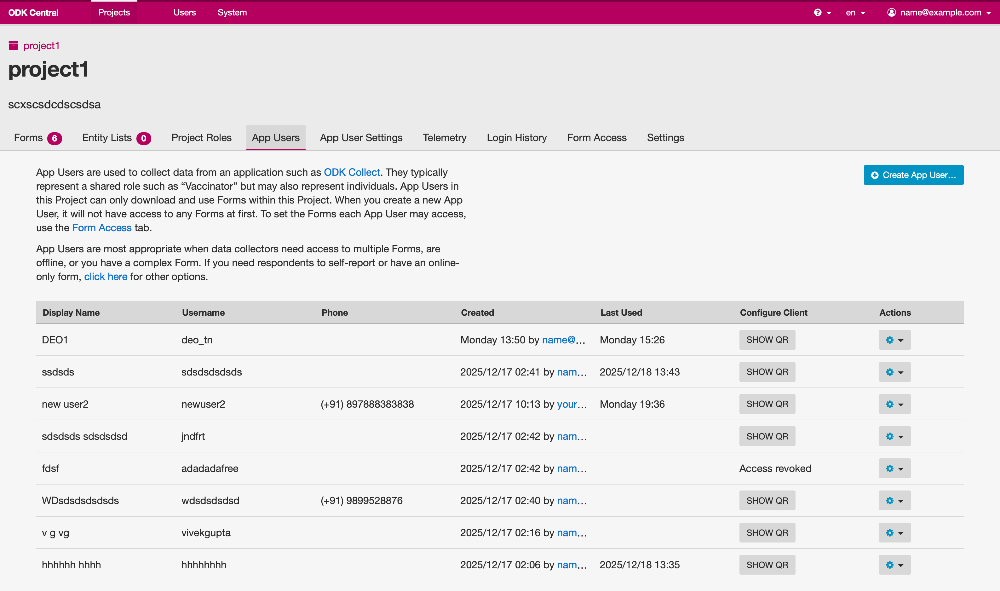
  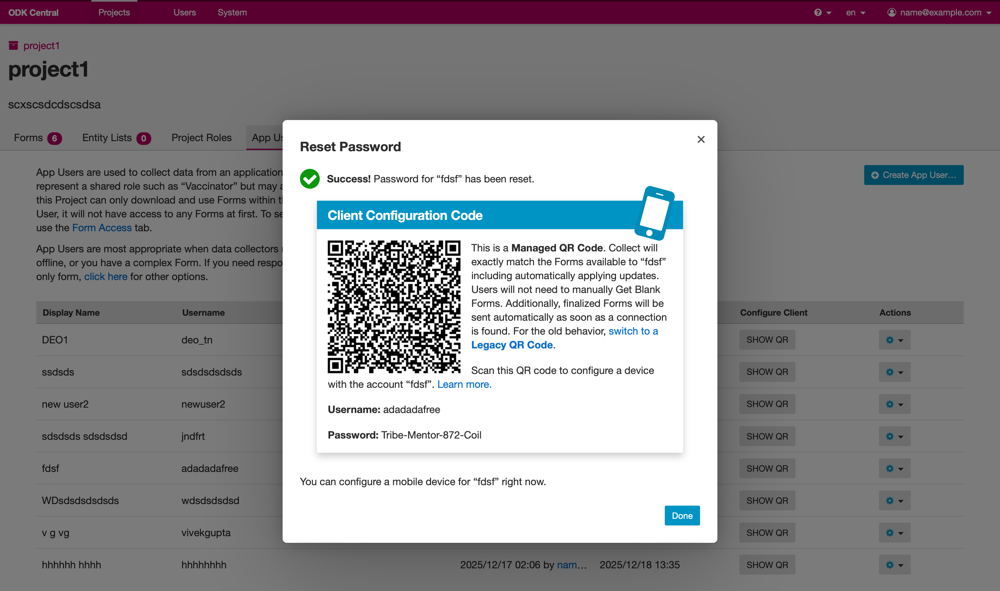


### B2. Security Policies
Project-specific security constraints, including mandatory PIN rotation and session timeout rules.
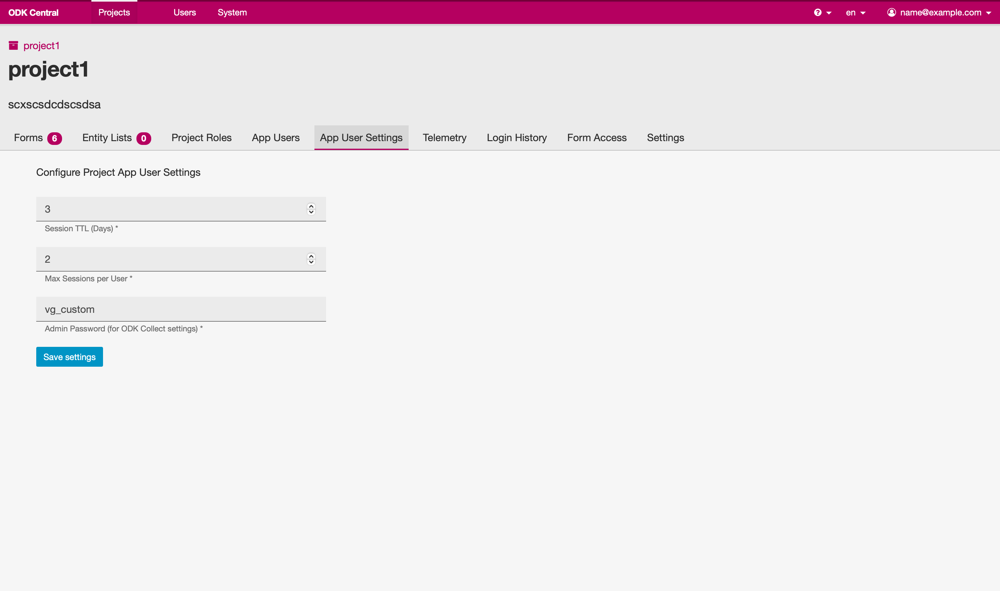

### B3. Telemetry & Live Mapping
Real-time geographic visualization of field worker health, battery status, and security events.
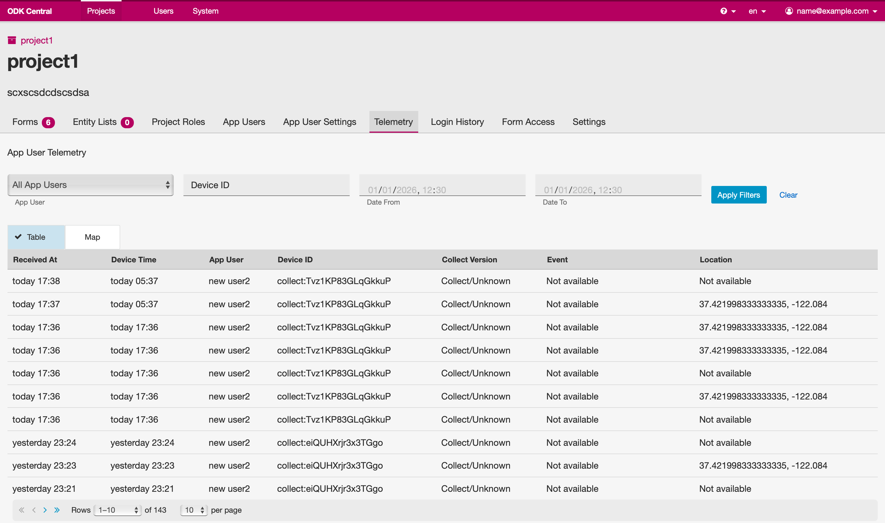
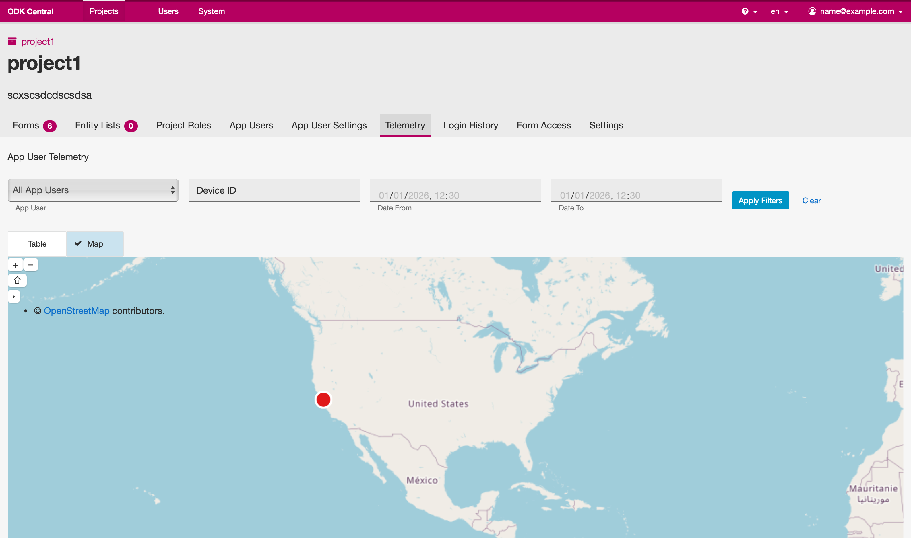

### B4. Audit Logs
Detailed login history and security audit trails synchronized from mobile devices.
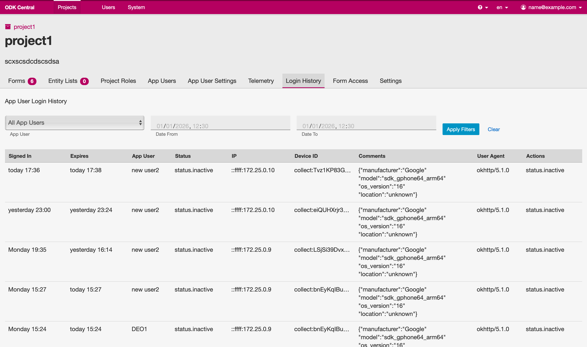

## End-to-end operational flow (Central → Collect → Central)

This is the intended day-to-day workflow for survey data managers and field staff.

### 1) Create app users in Central (web UI)

- Project admin/manager creates an App User with a unique username and optional phone.
- Central generates a strong password (or admin resets it) and provides credentials for the field worker.


### 2) Share configuration + credentials to the field worker

- Share server/project configuration (QR or manual config).
- Share credentials out-of-band (username/password). Credentials are not embedded in QR codes.

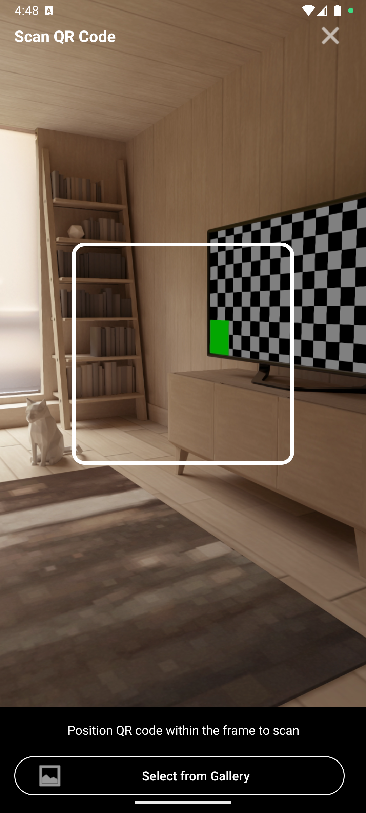
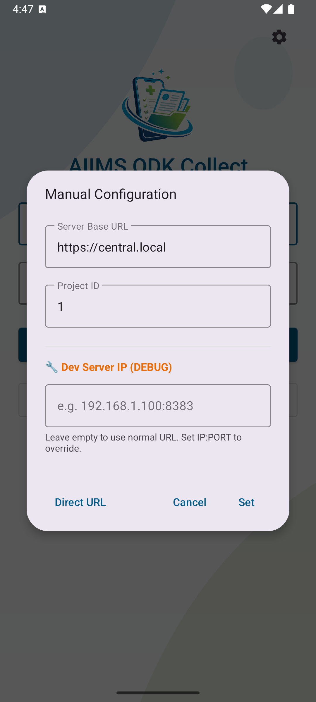

### 3) Field worker logs in on Collect and sets a PIN

- User logs in using username/password to obtain a short-lived token (password is not stored on device).
- On first-time setup, user creates a 4-digit PIN; PIN is required on app relaunch/foreground.

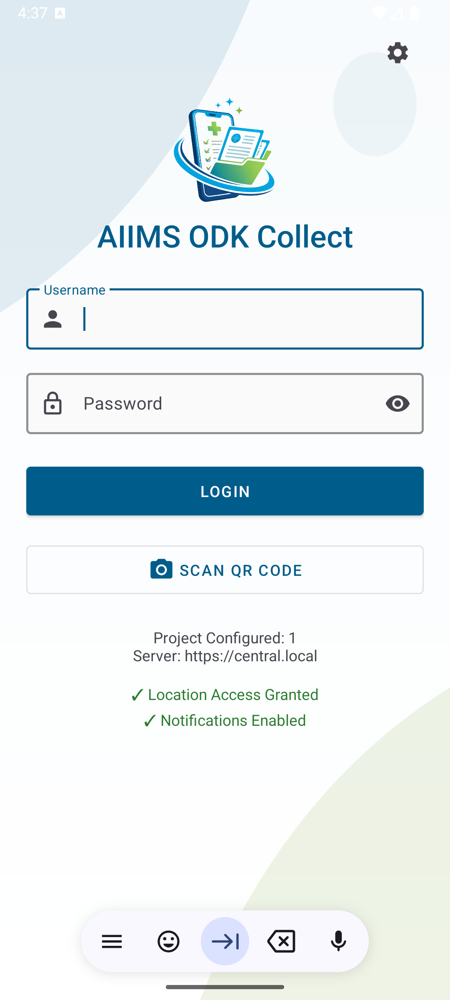
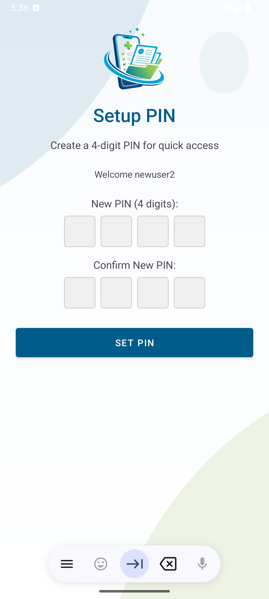

### 4) Session expiry, revalidation, and protections

- Collect shows token validity and can prompt for revalidation before expiry.
- If the token expires, Collect prompts the user to re-authenticate.
- Brute-force protection: repeated wrong PIN attempts can wipe local auth state and force re-login.
- Clock drift detection and permission checks help keep field work reliable.

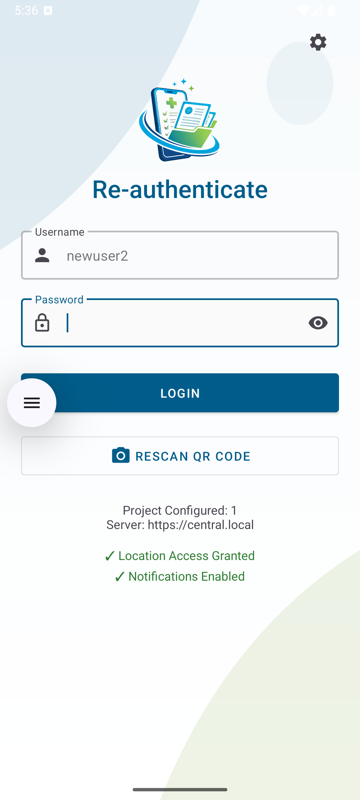
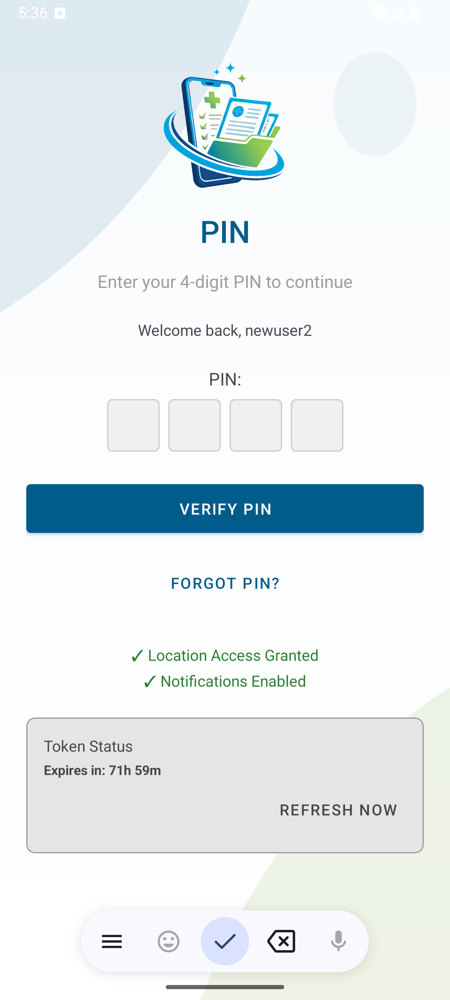
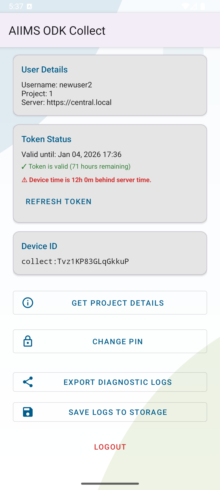
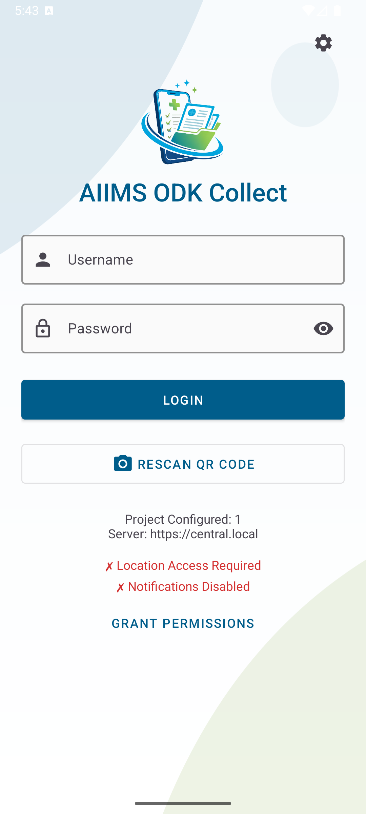

### 5) Telemetry and audit trails in Central

- Collect can submit device/security telemetry; Central can list it and visualize it on a map.
- Central records audit events for app-user lifecycle and authentication-related activity.


## Future ideas (not implemented)

- Device validation by project manager scanning a device QR

## Implemented (high level)

- Show number of active sessions/devices for an app user in Central
- Show token validity timer + revalidation notifications in Collect


## License

All of ODK Central is licensed under the [Apache 2.0](https://raw.githubusercontent.com/getodk/central/master/LICENSE) License.
